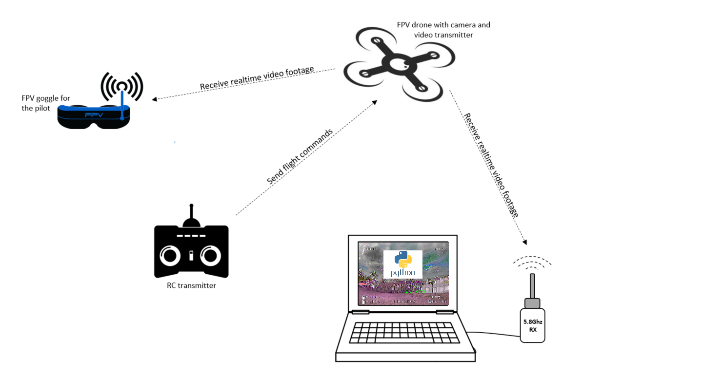

# XarisFPV FPV-OpenCV
OpenCV implementation for FPV drone footage.

Reads the video footage from saved videos, or realtime via USB 5.8Ghz FPV Video RX. 

## Labelnames
I refactored the label map into a flat structure for easier parsing. There are some skipped label ids in the source. Therefore I inserted a placeholder value "placeholder".  

## Used sources

Link for weights and config for ssd mobilenet v3: https://github.com/opencv/opencv/wiki/TensorFlow-Object-Detection-API

Download mobilenet v3 label map: https://github.com/tensorflow/models/raw/master/research/object_detection/data/mscoco_label_map.pbtxt

## ToDo's
When using a stream from webcam/USB 5.8Ghz RX and stopping the code execution, the output video is not usable, because the result.release() will not be executed.